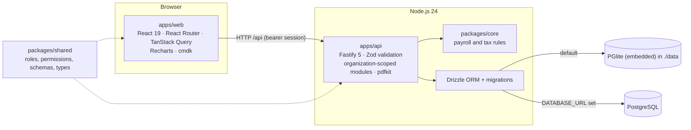

# PayFlow — India payroll workspace

[](https://github.com/mehulp007/PayFlow/actions/workflows/ci.yml)

PayFlow is a multi-tenant payroll application for Indian companies. Anyone can sign up and create an organization —
empty, or pre-filled with a generated sample company — and run the whole monthly cycle: employee records and
hierarchy, salary revisions, leave, pay periods, CSV input import, calculation (income tax, EPF, ESI and state
deductions), exception review, maker-checker approval, payment, period close, PDF payslips, statutory preparation
reports, analytics and an audit log. Employees get a self-service portal for their payslips, an old-versus-new
regime tax calculator with their Form 124 declaration, and leave requests that their manager or HR approves.

> **Synthetic data only.** PayFlow is a portfolio project. Its rules were reviewed against Indian regulations in
> October 2026, but it is not a certified payroll product and its exports are not government or bank upload
> formats. See [compliance notes](docs/compliance-notes.md).


## Roadmap

PayFlow is being rebuilt from its first prototype in phases. Each phase is committed and pushed when complete.

| Phase                      | Scope                                                                                                                                                                     | Status  |
| -------------------------- | ------------------------------------------------------------------------------------------------------------------------------------------------------------------------- | ------- |
| 0 · Baseline & cleanup     | Rebrand to PayFlow, remove hosting/mobile code, run locally with zero setup                                                                                               | ✅ Done |
| Compliance review          | Rules updated to October 2026 regulations: Labour Codes wage definition, EPF ₹25,000 ceiling with the September split, ESI period rules, state PT/LWF                     | ✅ Done |
| 1 · Engineering foundation | Shared Zod schemas, Drizzle migrations, modular Fastify API, React Router + TanStack Query, readable components and CSS, unit/integration/end-to-end tests, ESLint, CI    | ✅ Done |
| 2 · Multi-tenant sandbox   | Sign-up and onboarding, sample companies with history, tenant isolation, invitations, pay periods with send-back/pay/close, salary revisions, exits, year-to-date TDS     | ✅ Done |
| 3 · Features               | PDF payslips and history, regime calculator with Form 124 declarations, analytics, OSH Code leave, notifications, Ctrl-K palette, dark mode, audit log, multi-org sign-in | ✅ Done |
| 4 · Docs polish            | Architecture walkthrough and final screenshots                                                                                                                            | ⏳ Next |

## Quick start

Requires **Node.js 24** and npm. Nothing else: the database is embedded.

```bash
npm install
npm run dev
```

Open <http://127.0.0.1:5173> and choose one of three ways in:

1. **Explore a sample company.** Sign up, pick "Load a sample company", and you get 240 fictional people with
   April–September 2026 approved and October open. Use **View this sample as** in the sidebar to act as HR, Payroll,
   Finance, Auditor or the employee — enough to try maker-checker on your own.
2. **Create an organization.** Sign up and start empty: add branches, people and your first pay period, then invite
   your team by email.
3. **Use the built-in Aster Group.** A large sample company (8,420 people) created on first launch with six accounts
   that have their own random passwords, written to `data/individual-demo-credentials.txt` (ignored by Git).

| Aster Group username | Role                                                     |
| -------------------- | -------------------------------------------------------- |
| `admin`              | Organization admin: accounts, branches, reset the sample |
| `hr`                 | HR operator: people, hierarchy, payroll preparation      |
| `payroll`            | Payroll operator: import and calculate                   |
| `finance`            | Finance approver: approve, send back, pay and close      |
| `auditor`            | Read-only review and reports                             |
| `employee`           | Employee self-service for `EMP00001`                     |

To start over, stop the app and delete the `data/` folder.

## Try the payroll journey

1. Sign in as `hr` (Aster Group) and open the October run from **Payroll Runs**. Import
   [sample inputs](samples/payroll-inputs.csv) or use the preloaded ones, then **Calculate**.
2. Twelve new joiners have no bank details, which blocks submission. Verify them from **Needs attention** and
   recalculate. Open any row for its calculation trace: statutory wages, employer cost and the rules applied.
3. **Send for approval**. As `finance`, either **send it back with a note** (the payroll team fixes and resubmits)
   or approve it — the preparer can never approve their own run.
4. Export the demo bank file and preparation reports, **simulate reconciliation**, then **close the period**.
5. Open **New pay run** for November: the payment date must be before the 7th of the next month, and November's tax
   projection uses October's approved pay.
6. In **People** or **Compensation**, open a person to edit their record, add a salary revision effective from a
   future month, check their tax declaration and leave, or record an exit (the exit month is pro-rated and flagged
   for two-day final settlement).
7. Sign in as `employee`: compare the two tax regimes and declare rent and savings under **Tax & declarations**,
   request leave without pay under **Leave**, and download payslips as PDF.
8. Back as `hr`, the bell shows the request. Approve it on **Leave**, recalculate October, and the employee's line
   shows the unpaid days. Press **Ctrl K** anywhere to jump to a person, a pay run or a page, and use the moon
   icon for dark mode.

## Features

- **Organizations**: public sign-up with a three-step wizard; branches (which decide state rules) and pay groups;
  every table carries an organization ID and every query is scoped by it — another organization's records are
  simply not found.
- **Sample companies**: 240 generated people with realistic names, an 8-level hierarchy, salary history with an
  April increment, ESI-covered support staff, six approved and closed months and an open October run. The owner can
  switch roles with an audited **View as**; a reset regenerates everything.
- **Accounts**: invitations by email and role through a one-time link (the invitee sets their own password), admin
  password resets with a forced change, scrypt-hashed passwords, hashed 12-hour session tokens, login and sign-up
  rate limits and lockout.
- **Pay periods**: create a run for any month and pay group; draft → calculated → approval pending → approved →
  paid → closed, with Finance send-back. Approved lines are frozen. Joiners and leavers are pro-rated by calendar
  days. Monthly TDS uses actual year-to-date salary and tax from approved runs.
- **People**: directory, hierarchy explorer, editable records, effective-dated salary revisions, exits with
  reassignment checks.
- **Tax declarations and regimes**: employees declare rent, s. 123 savings, NPS, health insurance and home-loan
  interest on a Form 124-style form, HR verifies it, and a calculator compares the year under both regimes with
  the same projection that monthly TDS uses.
- **Leave**: earned leave under the OSH Code (one day per 20 days worked last year, after 180 days, with up to 30
  days carried forward), sick and casual leave, and leave without pay. Requests go to the person's manager or HR;
  approved unpaid leave becomes loss of pay in that month's run.
- **Payslips**: a wage slip for every approved month, viewable in the portal or downloadable as a PDF with
  earnings, deductions, employer contributions and statutory wages.
- **Analytics**: monthly cost trend, cost by department, statutory contributions, headcount by level and type, and
  the biggest month-over-month pay changes. Lines whose gross pay moves more than 25% are flagged for review.
- **Workspace**: a notification bell (approval requests, send-backs, payslips, leave decisions), a Ctrl K
  command palette with server-side search, an audit log with filters, dark mode, and one sign-in for several
  organizations with a switcher.
- **Calculation engine** (rule version `IN-TY2026-27-v3`, reviewed October 2026):
  - Income-tax Act, 2025: both regimes, the ₹60,000 rebate with marginal relief, surcharge and cess, monthly TDS
    under s. 392, and old-regime deductions from Form 124 including the 50% HRA limit for eight cities (rule 279).
  - Labour Codes "wages" with the 50% exclusion cap; Code on Wages payment deadline and exit settlement reminder.
  - EPF/EPS/EDLI: the ₹25,000 ceiling from 17 September 2026 with the EPFO day-split for September, EPS exit at 58,
    and admin charges.
  - ESI: contribution-period continuation and the ₹176/day exemption.
  - Professional tax and labour welfare fund for Karnataka, Maharashtra, Tamil Nadu, West Bengal and Haryana,
    shown per organization on the compliance page.

## Interface

| Analytics                                                    | Analytics in dark mode                                         |
| ------------------------------------------------------------ | -------------------------------------------------------------- |
|                  |         |
| **Payroll review**                                           | **Regime calculator and Form 124**                             |
|        |  |
| **Leave approvals**                                          | **Command palette**                                            |
|                          |        |
| **Calculation trace**                                        | **Payslips**                                                   |
|  |                      |

More: [sign-in](docs/screenshots/login.png) · [sign-up](docs/screenshots/signup.png) ·
[overview](docs/screenshots/hr-overview.png) · [pay runs](docs/screenshots/pay-runs.png) ·
[payroll in dark mode](docs/screenshots/payroll-dark.png) · [audit log](docs/screenshots/audit-log.png) ·
[salary history](docs/screenshots/salary-history.png) · [hierarchy](docs/screenshots/hierarchy.png) ·
[state rules](docs/screenshots/compliance.png) · [employee portal](docs/screenshots/employee-portal.png) ·
[settings](docs/screenshots/settings.png)

## Architecture



| Workspace         | Responsibility                                                                                                                                                                                                                                                                          |
| ----------------- | --------------------------------------------------------------------------------------------------------------------------------------------------------------------------------------------------------------------------------------------------------------------------------------- |
| `packages/core`   | Pure calculation library in integer paise: income tax, Labour Codes wages, EPF/EPS/EDLI, ESI, state PT/LWF. No I/O.                                                                                                                                                                     |
| `packages/shared` | One source of truth used by both apps: roles and the permission matrix, Zod request schemas and response types.                                                                                                                                                                         |
| `apps/api`        | Fastify app built by `buildApp()`. Modules for `organizations`, `auth` (identities, memberships, sessions, invitations), `employees`, `runs` (with PDF payslips), `leave`, `tax`, `analytics` and `workspace` (notifications, search, audit log); every service takes the organization. |
| `apps/web`        | React app with real URLs (`/overview`, `/payroll/:runId`, `/analytics`, `/leave`, `/audit`, `/me/tax`, …), a TanStack Query data layer, shared UI components, and light and dark design tokens in CSS split by area. Charts load only on pages that show them.                          |

**Tenancy.** A person signs in with one identity, which can have memberships in several organizations, each with
its own role. Each session belongs to one membership, so every request resolves to one organization; services
receive that organization's ID and filter every query by it, and employee codes (`EMP00001`) are unique only
within an organization. An admin can reset a password only for people who belong to that organization alone. Isolation is covered by integration tests that try to read and act on another organization's runs,
people, accounts and exports.

**Database.** The schema lives in [`apps/api/src/db/schema.ts`](apps/api/src/db/schema.ts). SQL migrations are
generated with `npm run db:generate -w @payflow/api` and applied automatically at start-up. PGlite (real PostgreSQL
compiled to WebAssembly) runs inside the API process, so there is nothing to install; set `DATABASE_URL` to use a
PostgreSQL server instead.

## Testing

| Command             | What it checks                                                                                                                                                                                                                                                         |
| ------------------- | ---------------------------------------------------------------------------------------------------------------------------------------------------------------------------------------------------------------------------------------------------------------------- |
| `npm test`          | 43 statutory rule cases in the calculation library, and 50 API integration tests against an in-memory database                                                                                                                                                         |
| `npm run e2e`       | Four Playwright journeys in a real browser: a run prepared, sent back, approved, paid and closed; sign-up with a sample company, role switching and PDF payslips; unpaid leave from request to the pay run with notifications, Ctrl K and dark mode; audit log filters |
| `npm run typecheck` | TypeScript across all four workspaces                                                                                                                                                                                                                                  |
| `npm run lint`      | ESLint (TypeScript and React hooks rules)                                                                                                                                                                                                                              |
| `npm run format`    | Prettier                                                                                                                                                                                                                                                               |

The API tests boot the real app with `buildApp()` on PGlite in memory. They cover sign-up validation, sample
history and year-to-date tax, empty organizations, tenant isolation, invitations, view-as and resets, sessions and
lockout, role permissions, employee self-service limits, salary revisions, exits and proration, imports, the
exception gate, send-back, maker-checker, payment, close, payment deadlines, exports, PDF payslips, leave balances
and approvals, declarations and the regime calculator, notifications, search, the audit log, analytics, and
switching between organizations. Locally, `npm run e2e` uses
Microsoft Edge; CI installs Chromium. GitHub Actions runs every check on each push.

## Scripts

| Command                               | What it does                                  |
| ------------------------------------- | --------------------------------------------- |
| `npm run dev`                         | Start the API and web app together            |
| `npm run build`                       | Production build of all workspaces            |
| `npm run db:generate -w @payflow/api` | Generate a migration after editing the schema |
