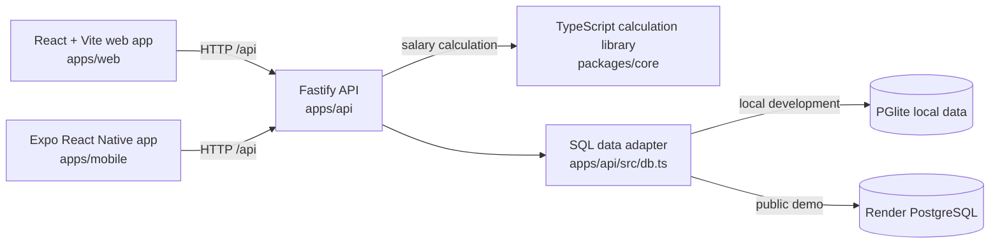

# PayFlow — India payroll prototype

**Public demo:** [Open Payroll Studio Demo](https://payroll-studio-demo.onrender.com/). The shared showcase runs on Render Free in Singapore with 240 fictional people and five one-click sample roles. It is useful for exploring the web workflow; do not enter real employee, salary, tax or bank information.

**Naming:** PayFlow is the repository name; the website currently retains its Payroll Studio Demo branding.

**Local prototype:** This repository also runs a larger, single-organization sample with 8,420 fictional people across five Indian states. It includes a React web app, a Fastify API, an Expo Android/iOS client, and a TypeScript calculation library. Local data uses PGlite; the hosted demo uses a separate Render PostgreSQL database.

**Live payroll status:** A service where any organization can sign up and process real payroll has not been built. The current application cannot initiate bank transfers or produce validated statutory filings or bank-upload files. Production needs organization isolation, reviewed Indian payroll rules, security controls, durable hosting and pilot sign-off. See the [live service readiness audit](docs/live-service-readiness.md) and [production gates](docs/production-gates.md).

## Repository layout

| Path | Purpose |
|---|---|
| `apps/web/` | HR, Finance, Auditor and employee web views |
| `apps/api/` | Authentication, demo data, payroll workflow and API |
| `apps/mobile/` | Expo Android/iOS client and EAS build profiles |
| `packages/core/` | Salary, tax and statutory starter calculations with unit tests |
| `render.yaml` | Separate Free web and PostgreSQL services for the public sample demo |
| `docs/` | Readiness audit, deployment guidance, release gates and UI screenshots |
| `samples/` and `scripts/` | Example import and local smoke check |

Generated `data/`, credentials, build output and dependencies are intentionally excluded from Git.

## Architecture (current prototype)



The `apps/web/` React app handles the HR, Payroll, Finance, Auditor and Employee screens. The `apps/mobile/` Expo app presents the same sample workflow through its own interface. Both call the [Fastify API](apps/api/src/server.ts); payroll calculations stay on the server and use the shared [`@payroll/core` library](packages/core/src/payroll.ts). In local development, Vite serves the web app separately. On Render, the API also serves the built web files when `SERVE_WEB=1`, so the public demo uses one web service.

**Sign-in and access:** Each client sends a bearer token after login. The API checks the account and role, and limits employee self-service to the linked employee; web tokens live in tab session storage, while mobile tokens remain in app memory. The [authentication module](apps/api/src/auth.ts) stores user accounts and sessions in the database. The public showcase additionally offers one-click sample-role access. These are demo controls, not production identity or MFA.

**Payroll flow:** HR or Payroll previews and validates a CSV, then commits accepted rows to `payroll_inputs`. The API calls `calculatePayroll` in `@payroll/core` for active people in payroll scope and stores results in `payroll_lines`. Blocking exceptions stop submission. A Finance Approver who did not prepare the run can approve it. The API then exposes payslips, a marked demo bank CSV, statutory preparation CSVs and a simulated reconciliation step. `audit_events` records key actions. Contractors remain in the employee directory and attendance view but outside payroll calculation.

**Storage and deployment:** The [database adapter](apps/api/src/db.ts) chooses local PGlite when `DATABASE_URL` is absent and PostgreSQL when it is present. Core tables cover employees, payroll runs, inputs, calculation lines and audit events; authentication adds users and sessions. The [Render blueprint](render.yaml) builds the web/API workspaces and connects the demo service to a separate Free PostgreSQL database. Local and hosted demo data are separate; all visitors to the hosted demo share its fictional dataset.

This diagram describes the **single-organization prototype**. It has no organization sign-up or tenant isolation, and its calculation and export formats are not approved for real payroll. The [live service readiness audit](docs/live-service-readiness.md) describes the proposed production architecture and release gaps.

## Interface previews


## Run it locally

Use Node.js 24 and npm. From this directory:

```powershell
npm ci
npm run build -w @payroll/core
npm run dev
```

Open [http://127.0.0.1:5173](http://127.0.0.1:5173). The API runs at `http://127.0.0.1:4000`. Synthetic records are created on first launch in `data/payroll-pg`. Sign in as `admin` and use **Settings** to reset the demo run to draft.

Run only one API process at a time. A local lock now stops a second process before it opens the database.

### Sign in to the demo

Six local accounts are created when the API first starts:

| Username | Access |
|---|---|
| `admin` | Organization Admin; manage demo accounts and reset the run |
| `hr` | HR Operator; add people and maintain records |
| `payroll` | Payroll Operator; import and calculate |
| `finance` | Finance Approver; approve and reconcile |
| `auditor` | Auditor; read-only review and reports |
| `employee` | Employee self service for `EMP00001` |

Each built-in account now has a **different, randomly generated password**. On first launch, the API writes the six individual credentials to [`data/individual-demo-credentials.txt`](data/individual-demo-credentials.txt). That file stays on this computer, outside the website, and is ignored by Git. Keep it private. Sign in as `admin`, then open **Settings → Roles & access** to create accounts for additional staff or employees. The mobile app also has an **Access** tab for admins. New accounts receive a one-time temporary password, shown only to the admin who created them; each user must replace it with a private password before opening payroll. An employee account must link to one active employee ID. Admins can reset another person's password when needed; this issues another one-time password and ends that person's existing sessions. Every account can change its own password later. Keep real personal or payment data out of this demo.

Sessions expire after 12 hours. Web sign-in remains active only in the current browser tab session; mobile sign-in stays in memory until the app closes or the user signs out. The API checks every request against the signed-in account. The old role switcher and `x-demo-user` header no longer grant access.

For the mobile client, start the API and then run `npm run dev:mobile`. The Android emulator uses `10.0.2.2:4000`; the iOS simulator uses `127.0.0.1:4000`. Set `EXPO_PUBLIC_API_URL` to a reachable API address for a different simulator setup. Keep the local demo on a trusted network only. Android and iOS JavaScript bundles can be checked with `npx expo export --platform android` and `npx expo export --platform ios` from `apps/mobile`.

## Hosted demo and Android pilot

The [public demo](https://payroll-studio-demo.onrender.com/) is deployed automatically from this repository's `main` branch using `render.yaml`. It runs on a Free Render web service and a separate Free Render PostgreSQL database in Singapore. The sign-in page offers HR Operator, Payroll Operator, Finance Approver, Auditor and Employee sample roles. All visitors share the same fictional records. HR can restore the sample run from **Settings → Reset shared demo**, which also clears changes made by other visitors.

The Free web service may take a minute or more to wake after inactivity. Its Free database expires on **28 October 2026** unless replaced or upgraded. This hosting is for the showcase only; it is not durable, India-region production payroll hosting. The local prototype still seeds 8,420 fictional people, while the hosted demo seeds 240.

The Expo mobile source is in `apps/mobile/`, with EAS profiles for a direct-install APK (`preview`) and Google Play internal-testing AAB (`play-internal`). No signed APK, AAB or Play listing has been created. To build against the public sample API, link an Expo account, choose an Android package ID you control in `apps/mobile/app.json`, and set the EAS `preview` environment variable `EXPO_PUBLIC_API_URL` to `https://payroll-studio-demo.onrender.com`. The existing [preview deployment guide](docs/deploy-preview.md) documents a separate Oracle/Duck DNS hosting route; the active public demo uses Render.
## Explore the journey

1. Start as **HR Operator**. Open **Payroll Runs** and import [sample inputs](samples/payroll-inputs.csv), or use the preloaded synthetic inputs.
2. Calculate the September 2026 payroll. The initial 12 bank-detail exceptions block submission.
3. Open an exception, verify the fictional account ending, and recalculate. Review totals and employee-level explanations.
4. Send the run for approval. Sign out and sign in as `finance` to approve it. The HR account cannot approve.
5. Export the clearly marked **demo** bank CSV, view preparation reports, and simulate reconciliation.
6. Sign out and sign in as `employee` to see only that employee's record and, after approval, their payslip. During draft, the employee can choose the old or new tax regime.
7. Open **Hierarchy** to filter contractor, casual, fixed-term, probation, and permanent people by position level, department, state, and search. Open a row for work, pay, attendance, leave, manager, and statutory details. HR can add and activate a person before calculation.

The mobile client covers the same demonstration run: overview, hierarchy browsing and adding, input CSV preview/import, exception resolution, approval, reports, employee record, tax choice, and payslip. Report sharing uses the operating system share sheet and is a prototype interaction.

## What is implemented

- Salary calculation in integer paise with new/old regime tax projection, monthly TDS, employee and employer EPF/EPS/EDLI, ESI, professional tax and labour welfare fields.
- An effective date for the EPF wage ceiling change on 17 September 2026.
- CSV column and row validation, duplicate checks, input lock after calculation, blocking exceptions, separate finance approval, audit events, and a demo reconciliation step.
- Searchable employee directory and payroll review, employee payslip, and CSV preparation reports.
- A separate employment category and position hierarchy from Associate through Managing Director. Contractor records support directory and attendance but are excluded from salary payroll calculations. HR adds and activates records directly during the draft run.
- Local persistent synthetic data. The API refuses `NODE_ENV=production` to prevent this demo from being mistaken for a production service.

## Compliance and production boundary

The calculation pack is a **starter implementation**, not an approved Indian payroll rule set. Professional tax is seeded as ₹200 and labour welfare as ₹0 for every state; those are placeholders. EPF membership and ESI membership are seeded values. The tax projection does not yet model all exemptions, salary components, declarations, proofs, prior-employer reconciliation, special-rate income, or every edge case. ESI contribution-period continuation, actual EPF/EPS eligibility, minimum wages, labour-code wages, gratuity, arrears, and mid-period employment events still need specialist design and test cases. The CSV reports are **preparation data**, not validated government upload formats. The demo bank file contains fictional account references and is not suitable for a bank.

Production work also requires real SSO and MFA, person-level separation of duties, encrypted and masked PAN/bank/UAN/ESI data, effective-dated signed state rule packs, immutable run versions and corrections, a configured bank template with reconciliation, a production PostgreSQL service, background jobs, backup/restore, monitoring, India-region hosting, mobile distribution, and two parallel payroll cycles with a real employer. See [production gates](docs/production-gates.md).

The tax and social-security starter values were based on the [2026 Budget memorandum](https://www.indiabudget.gov.in/doc/memo.pdf), [Income Tax Department Form 138 guidance](https://www.incometax.gov.in/iec/foportal/newformpage/forms/form138-um), [EPF ceiling announcement](https://www.pib.gov.in/PressReleasePage.aspx?PRID=2310973&lang=1&reg=3), and [ESIC contribution guidance](https://www.esic.gov.in/attachments/publicationfile/6f673bcd3d6110170f790d2909767b4f.pdf). A payroll specialist must check effective rules, source notifications, and portal schemas before live use.

## Verification

```powershell
npm run typecheck
npm run test
npm run build
npm run smoke
```

`npm run smoke` requires the local API running. It exercises the full synthetic run, employee access controls, and approval gate, then resets the run to draft. The web app can be opened at `http://127.0.0.1:5173` for UI review.
