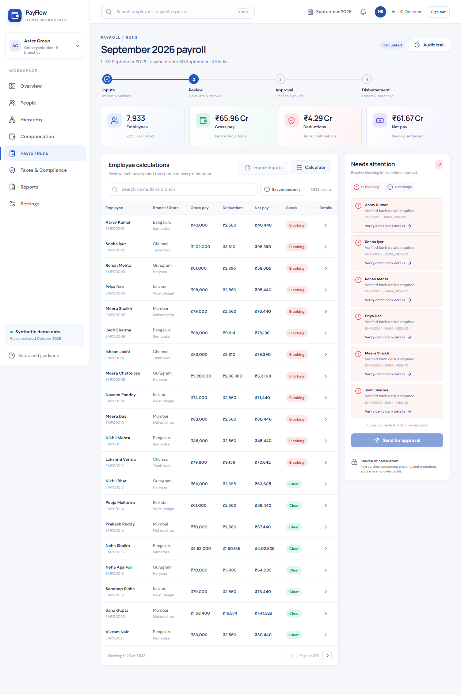
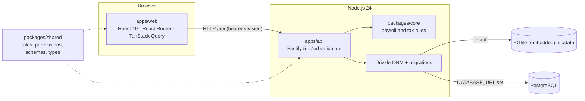
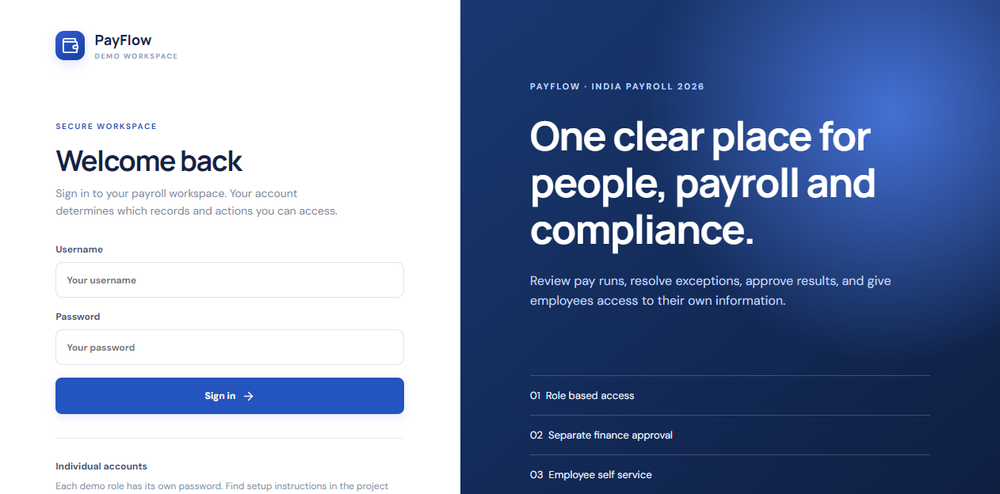
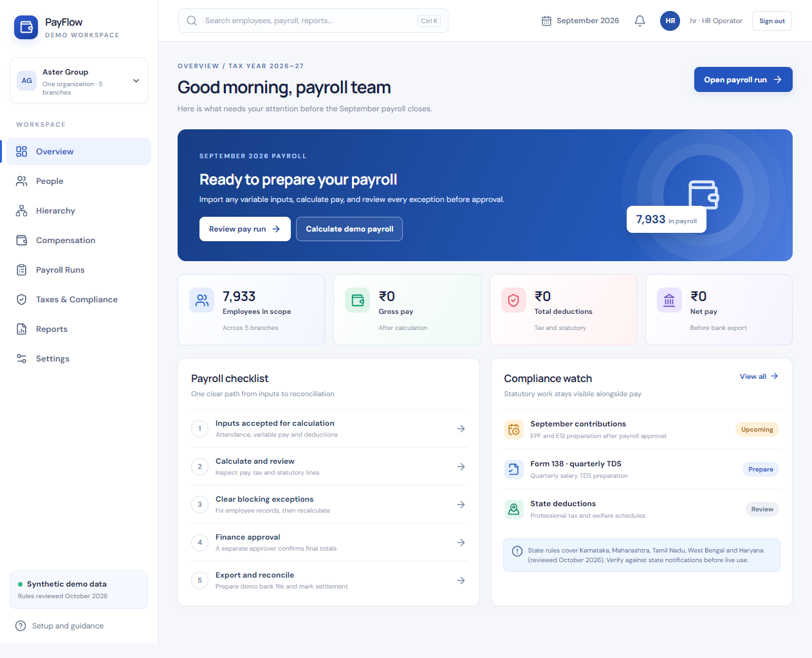
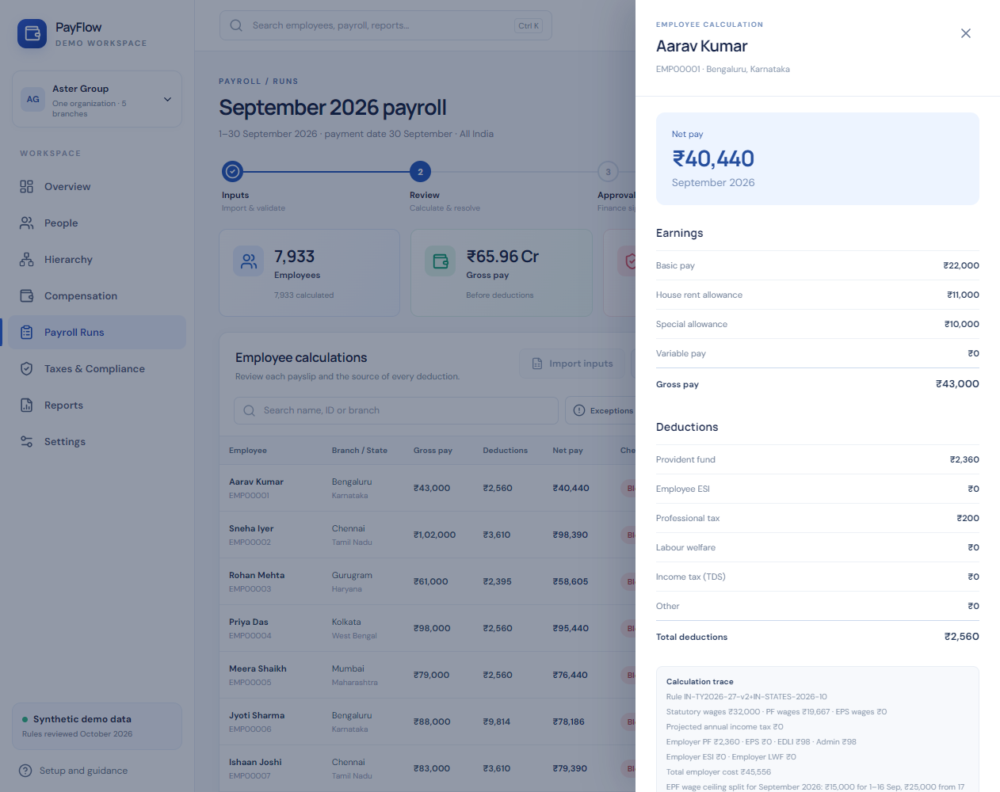
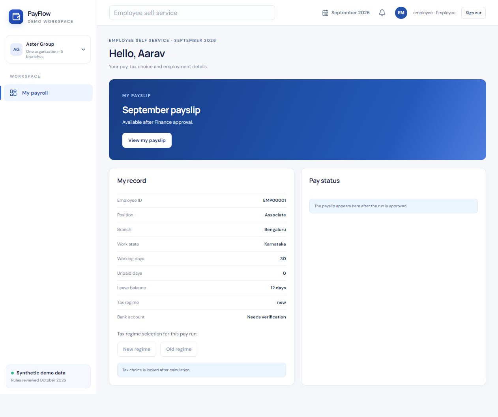
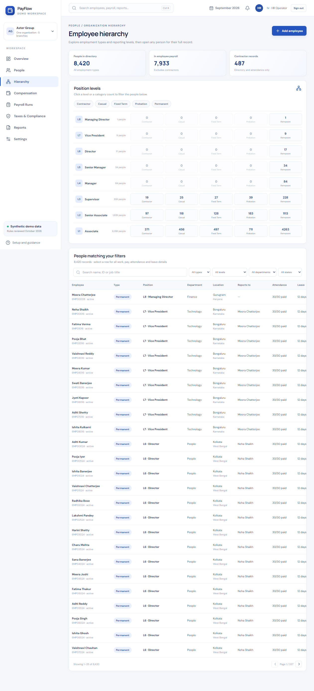

# PayFlow — India payroll workspace

[](https://github.com/mehulp007/PayFlow/actions/workflows/ci.yml)

PayFlow is a full-stack payroll application for Indian companies. It covers the whole monthly cycle: employee
records and hierarchy, CSV input import with validation, salary calculation (income tax, EPF, ESI and state
deductions), exception review, maker-checker approval, payslips, statutory preparation reports and an audit trail.
Employees get a self-service portal for their own record, tax-regime choice and payslip.

> **Synthetic data only.** PayFlow is a portfolio project. Its rules were reviewed against Indian regulations in
> October 2026, but it is not a certified payroll product and its exports are not government or bank upload
> formats. See [compliance notes](docs/compliance-notes.md).



## Roadmap

PayFlow is being rebuilt from its first prototype in phases. Each phase is committed and pushed when complete.

| Phase                      | Scope                                                                                                                                                                  | Status  |
| -------------------------- | ---------------------------------------------------------------------------------------------------------------------------------------------------------------------- | ------- |
| 0 · Baseline & cleanup     | Rebrand to PayFlow, remove hosting/mobile code, run locally with zero setup                                                                                            | ✅ Done |
| Compliance review          | Rules updated to October 2026 regulations: Labour Codes wage definition, EPF ₹25,000 ceiling with the September split, ESI period rules, state PT/LWF                  | ✅ Done |
| 1 · Engineering foundation | Shared Zod schemas, Drizzle migrations, modular Fastify API, React Router + TanStack Query, readable components and CSS, unit/integration/end-to-end tests, ESLint, CI | ✅ Done |
| 2 · Multi-tenant sandbox   | Sign up and create an organization, start empty or load a sample company, tenant isolation, invitations, any pay period, salary revisions, state rule tables           | ⏳ Next |
| 3 · Features               | Payslip PDFs and history, tax-regime calculator, analytics dashboard, leave & attendance, notifications, Ctrl-K palette, dark mode, audit log page                     | Planned |
| 4 · Docs polish            | Architecture walkthrough and final screenshots                                                                                                                         | Planned |

## Architecture



| Workspace         | Responsibility                                                                                                                                                                       |
| ----------------- | ------------------------------------------------------------------------------------------------------------------------------------------------------------------------------------ |
| `packages/core`   | Pure calculation library in integer paise: income tax, Labour Codes wages, EPF/EPS/EDLI, ESI, state PT/LWF. No I/O.                                                                  |
| `packages/shared` | One source of truth used by both apps: roles and the permission matrix, Zod request schemas and response types.                                                                      |
| `apps/api`        | Fastify app built by `buildApp()`. Feature modules (`auth`, `employees`, `runs`) each have routes and a service; a preHandler resolves the session and enforces permissions.         |
| `apps/web`        | React app with real URLs (`/overview`, `/payroll`, `/hierarchy`, `/me`, …), a TanStack Query data layer, shared UI components and design tokens in CSS split by area (`src/styles`). |

**Database.** The schema lives in [`apps/api/src/db/schema.ts`](apps/api/src/db/schema.ts). SQL migrations are
generated with `npm run db:generate -w @payflow/api` and applied automatically at start-up. PGlite (real
PostgreSQL compiled to WebAssembly) runs inside the API process, so there is nothing to install; set
`DATABASE_URL` to use a PostgreSQL server instead.

## Quick start

Requires **Node.js 24** and npm. Nothing else: the database is embedded.

```bash
npm install
npm run dev
```

Open <http://127.0.0.1:5173>. The API runs on port 4000. On first launch it creates a synthetic company
("Aster Group", 8,420 fictional people across five Indian states) in `data/db`.

### Sign in

Six accounts are created on first launch, each with its own random password. The passwords are written to
`data/individual-demo-credentials.txt` on your machine (ignored by Git).

| Username   | Role                                                 |
| ---------- | ---------------------------------------------------- |
| `admin`    | Organization admin: manage accounts, reset demo data |
| `hr`       | HR operator: people, hierarchy, payroll preparation  |
| `payroll`  | Payroll operator: import and calculate               |
| `finance`  | Finance approver: approve and reconcile              |
| `auditor`  | Read-only review and reports                         |
| `employee` | Employee self-service for `EMP00001`                 |

To start over, stop the app and delete the `data/` folder.

## Try the payroll journey

1. Sign in as `hr` and open **Payroll Runs**. Import [sample inputs](samples/payroll-inputs.csv) or use the
   preloaded ones, then **Calculate**.
2. Twelve employees have missing bank details, which block submission. Verify them from the **Needs attention**
   panel and recalculate. Open any row to see its calculation trace and the rules applied.
3. **Send for approval**, then sign in as `finance` and approve. The preparer can never approve their own run.
4. Export the demo bank file and preparation reports, then simulate reconciliation.
5. Sign in as `employee` to see only your own record, choose a tax regime (while the run is in draft) and view the
   payslip after approval.
6. Open **Hierarchy** to filter people by employment type, position level, department and state, and add a person.

## Features

- **Calculation engine** (rule version `IN-TY2026-27-v2`, reviewed October 2026):
  - Income-tax Act, 2025: both regimes, the ₹60,000 rebate with marginal relief, surcharge and cess, and monthly
    TDS (s. 392) from a year-to-date projection.
  - Labour Codes "wages" with the 50% exclusion cap.
  - EPF/EPS/EDLI: the ₹25,000 ceiling from 17 September 2026 with the EPFO day-split for September, EPS exit at
    58, and admin charges.
  - ESI: contribution-period continuation and the ₹176/day exemption.
  - Professional tax and labour welfare fund slabs for Karnataka, Maharashtra, Tamil Nadu, West Bengal and Haryana.
  - The employer cost of every line.
- **Payroll controls**: CSV validation with preview, inputs locked after calculation, blocking exceptions,
  separate finance approval, and an audit event for every key action.
- **People**: a searchable directory, an 8-level position hierarchy with five employment types, and contractors
  kept outside payroll.
- **Access**: password sessions (scrypt hashing, hashed tokens, 12-hour expiry), a shared role-permission matrix,
  login rate limiting and lockout, admin-issued one-time passwords and a forced first-password change.

## Interface

| Sign-in                                                      | Overview                                                 |
| ------------------------------------------------------------ | -------------------------------------------------------- |
|                        |             |
| **Calculation trace**                                        | **Employee portal**                                      |
|  |  |



## Testing

| Command             | What it checks                                                                                                       |
| ------------------- | -------------------------------------------------------------------------------------------------------------------- |
| `npm test`          | 30 statutory rule cases in the calculation library, and 23 API integration tests against an in-memory database       |
| `npm run e2e`       | Playwright journey in a real browser: HR prepares, Finance approves and reconciles, the employee views their payslip |
| `npm run typecheck` | TypeScript across all four workspaces                                                                                |
| `npm run lint`      | ESLint (TypeScript and React hooks rules)                                                                            |
| `npm run format`    | Prettier                                                                                                             |

The API tests boot the real app with `buildApp()` on PGlite in memory, covering sessions and lockout, the
temporary-password gate, role permissions, employee self-service limits, hierarchy validation, imports, the
exception gate, maker-checker approval, exports and demo reset. Locally, `npm run e2e` uses Microsoft Edge; CI
installs Chromium. GitHub Actions runs every check on each push.

## Scripts

| Command                               | What it does                                  |
| ------------------------------------- | --------------------------------------------- |
| `npm run dev`                         | Start the API and web app together            |
| `npm run build`                       | Production build of all workspaces            |
| `npm run db:generate -w @payflow/api` | Generate a migration after editing the schema |
