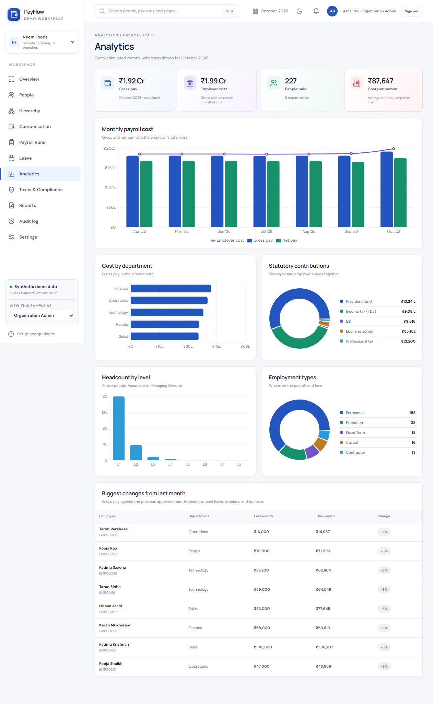
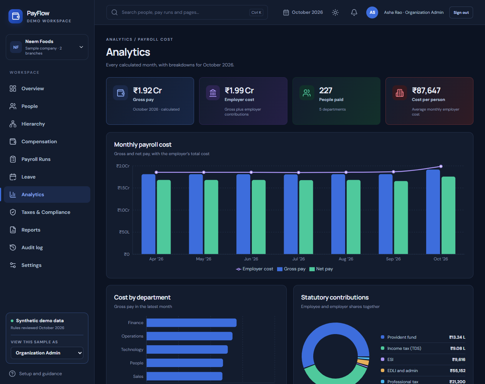
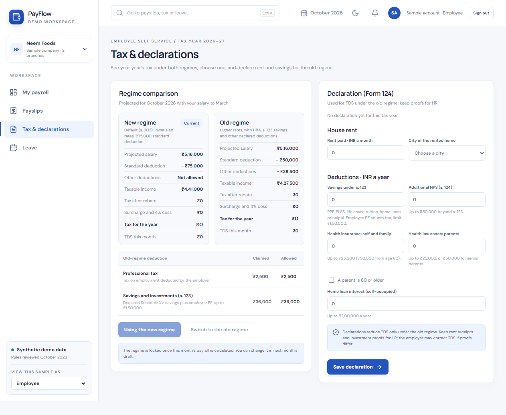
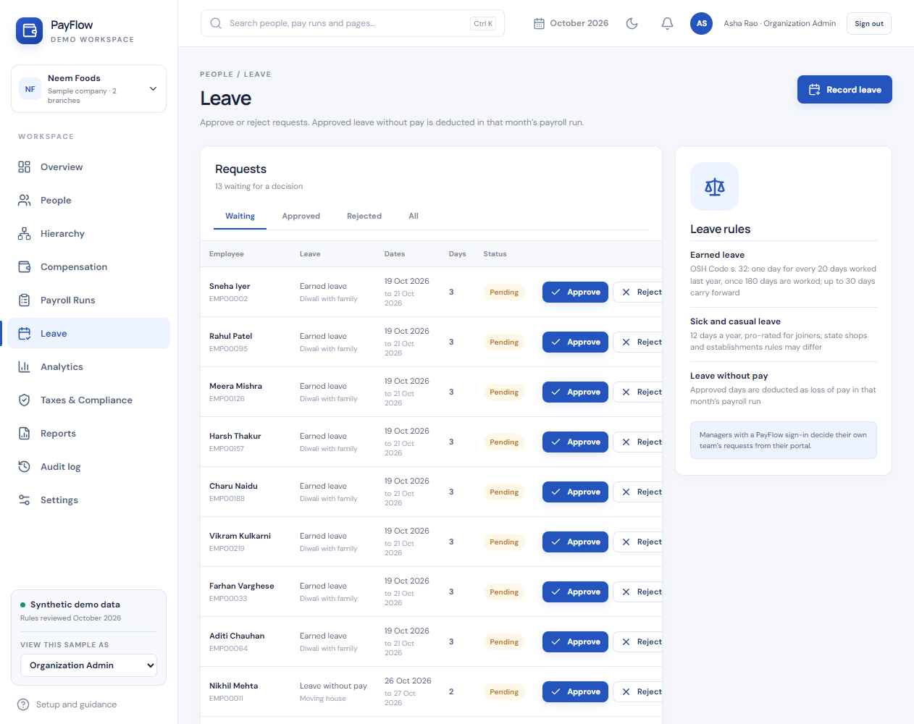
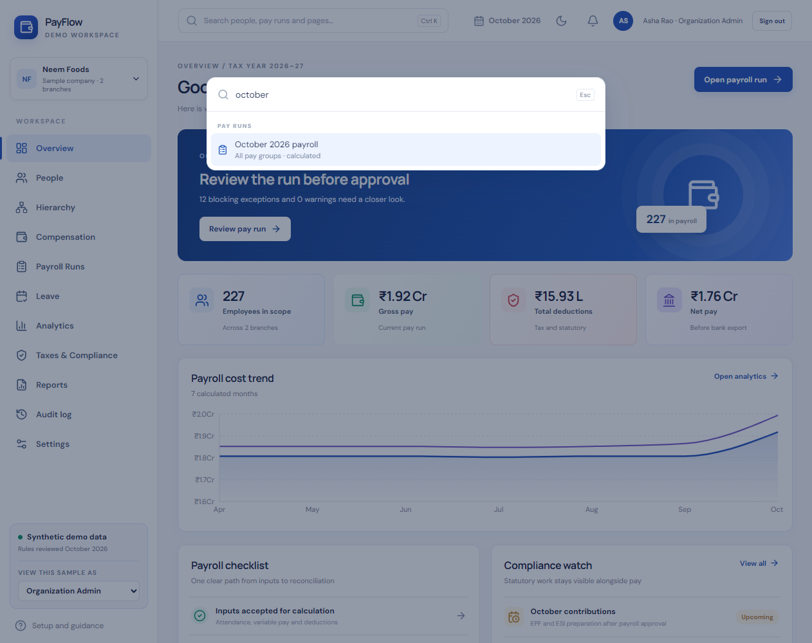
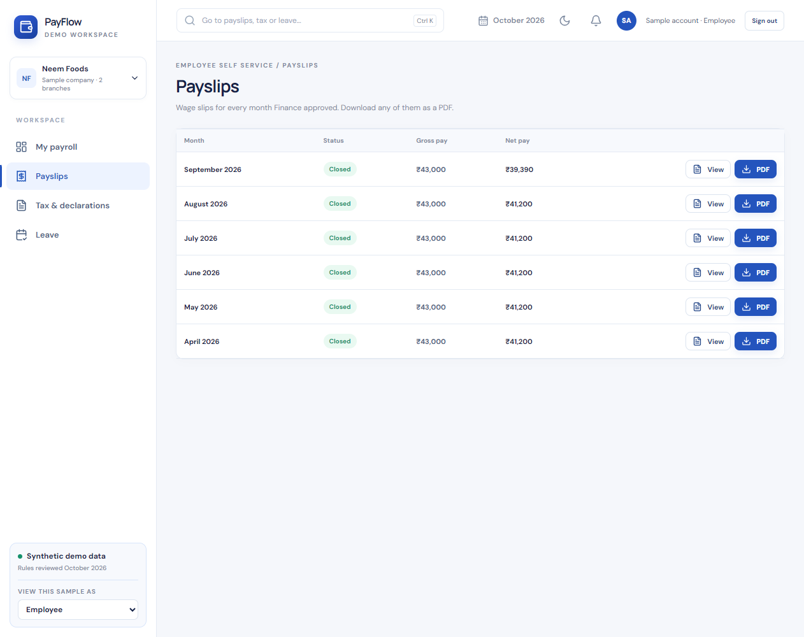
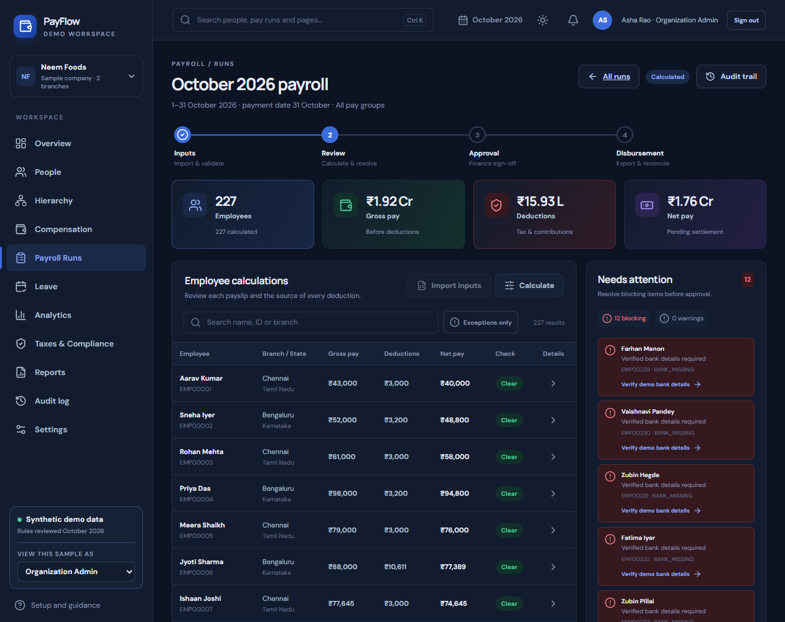
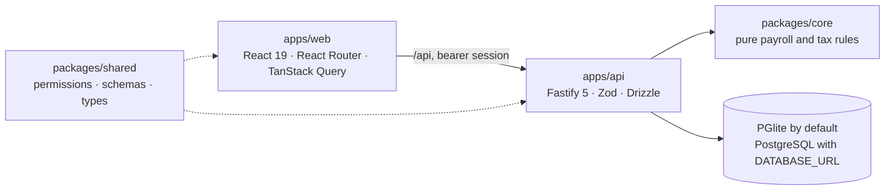

# PayFlow — India payroll workspace

[](https://github.com/mehulp007/PayFlow/actions/workflows/ci.yml)


[](LICENSE)

PayFlow runs the monthly payroll of an Indian company, from employee records to the bank file. Anyone can sign up,
load a generated sample company and act as HR, payroll, Finance, an auditor or an employee. It calculates income tax
under the Income-tax Act, 2025, EPF, ESI and state professional tax and welfare fund under the Labour Codes, with every
rule tested and every payslip traceable to the rule that produced it.

> **Synthetic data only.** PayFlow is a portfolio project. Its rules were reviewed against Indian regulations in
> October 2026, but it is not a certified payroll product and its exports are not government or bank upload
> formats. See the [compliance notes](docs/compliance-notes.md).


## Highlights

- **A full payroll cycle with maker-checker.** Open a month, import inputs, calculate, clear exceptions, send to
  Finance, who can send it back or approve (never the preparer), then record payment and close. Approved months are
  frozen snapshots.
- **Current Indian rules, explained per line.** Income tax for 2026-27 in both regimes with marginal relief, Labour
  Codes wages, the ₹25,000 EPF ceiling with September's day-split, ESI periods, and dated state rules such as West
  Bengal's October 2026 professional tax schedule. Each line shows its statutory wages, employer cost and notes.
- **Employees serve themselves.** Payslips as PDF, an old-versus-new regime calculator fed by their Form 124
  declaration, and leave under the OSH Code that flows into the pay run once approved.
- **Multi-tenant from the database up.** Organization ID on every row and query, one sign-in across several
  organizations, invitations by link, and isolation tests that try to cross the boundary.
- **Product polish.** Analytics, notifications, a Ctrl K command palette, an audit log, dark mode and phone layouts,
  all within the original design.
- **Engineered to be checked.** 44 rule tests, 50 API integration tests on a real database, four browser journeys,
  shared Zod schemas and permissions, and CI on every push.

## Quick start

Requires **Node.js 24** and npm. Nothing else: the database (PostgreSQL compiled to WebAssembly) is embedded.

```bash
npm install
npm run dev
```

Open <http://127.0.0.1:5173> and choose a way in:

1. **Explore a sample company.** Sign up, pick "Load a sample company", and you get 240 fictional people with
   April–September 2026 approved and October open. Use **View this sample as** in the sidebar to act as HR, Payroll,
   Finance, Auditor or the employee — enough to try maker-checker on your own.
2. **Create an organization.** Sign up and start empty: add branches, people and your first pay period, then invite
   your team by email.
3. **Use the built-in Aster Group.** A large sample company (8,420 people) created on first launch with six accounts
   that have their own random passwords, written to `data/individual-demo-credentials.txt` (ignored by Git).

| Aster Group username | Role                                                     |
| -------------------- | -------------------------------------------------------- |
| `admin`              | Organization admin: accounts, branches, reset the sample |
| `hr`                 | HR operator: people, leave, payroll preparation          |
| `payroll`            | Payroll operator: import and calculate                   |
| `finance`            | Finance approver: approve, send back, pay and close      |
| `auditor`            | Read-only review, reports and the audit log              |
| `employee`           | Employee self-service for `EMP00001`                     |

To start over, stop the app and delete the `data/` folder.

## A guided tour

1. Sign in as `hr` (Aster Group) and open the October run from **Payroll Runs**. Import
   [sample inputs](samples/payroll-inputs.csv) or use the preloaded ones, then **Calculate**.
2. Twelve new joiners have no bank details, which blocks submission. Verify them from **Needs attention** and
   recalculate. Open any row for its calculation trace: statutory wages, employer cost and the rules applied.
3. **Send for approval**. As `finance`, either **send it back with a note** (the payroll team fixes and resubmits)
   or approve it. The bell tells each side what happened.
4. Export the demo bank file and preparation reports, **simulate reconciliation**, then **close the period**.
5. Open **New pay run** for November: the payment date must be before the 7th of the next month, and November's tax
   projection uses October's approved pay.
6. In **People**, open a person to edit their record, add a salary revision, check their declaration and leave, or
   record an exit (the exit month is pro-rated and flagged for two-day final settlement).
7. Sign in as `employee`: compare the two tax regimes and declare rent and savings under **Tax & declarations**,
   request leave without pay under **Leave**, and download payslips as PDF.
8. Back as `hr`, approve the request on **Leave** and recalculate: the employee's line shows the unpaid days. Press
   **Ctrl K** to jump to a person, pay run or page, look at **Analytics**, and try the moon icon for dark mode.

## Features

| Area                  | What it does                                                                                                                                                                                                     |
| --------------------- | ---------------------------------------------------------------------------------------------------------------------------------------------------------------------------------------------------------------- |
| Organizations         | Three-step sign-up; branches (which decide state rules) and pay groups; sample companies with history, an audited **View as** switch and reset; one sign-in for several organizations                            |
| Accounts              | Invitations by one-time link (the invitee sets their own password, or confirms an existing one); admin resets with a forced change; scrypt passwords, hashed 12-hour sessions, rate limits and lockout           |
| People                | Directory, 8-level hierarchy explorer, editable records, effective-dated salary revisions, exits with reassignment checks                                                                                        |
| Pay periods           | A run for any month and pay group: draft → calculated → approval pending → approved → paid → closed, with send-back; CSV import with preview; joiners and leavers pro-rated; year-to-date TDS from approved runs |
| Review                | Blocking exceptions and warnings (missing bank details, deductions over 50% of wages, pay up or down more than 25% on last month, exit settlement); a calculation trace per line                                 |
| Payslips              | A wage slip for every approved month, in the portal or as a PDF with earnings, deductions, employer contributions and statutory wages                                                                            |
| Tax                   | Form 124 declarations verified by HR; the 50% HRA limit for eight cities; a regime calculator using the same projection as monthly TDS                                                                           |
| Leave                 | Earned leave under the OSH Code (one day per 20 days worked, after 180 days, up to 30 carried forward), sick and casual leave, leave without pay; decided by the manager or HR; unpaid days flow into the run    |
| Reports and analytics | Salary register, demo bank file, EPF/ESI/Form 138/state preparation CSVs; cost trend, department and statutory splits, headcount, biggest pay changes                                                            |
| Workspace             | Notification bell, Ctrl K command palette with server search, audit log with filters, dark mode, phone layouts                                                                                                   |

Rule details and sources are in the [compliance notes](docs/compliance-notes.md).

## Screens

| Analytics                                                      | Analytics in dark mode                                   |
| -------------------------------------------------------------- | -------------------------------------------------------- |
|                    |   |
| **Regime calculator and Form 124**                             | **Leave approvals**                                      |
|  |                      |
| **Calculation trace**                                          | **Command palette**                                      |
|    |  |
| **Payslips**                                                   | **Payroll in dark mode**                                 |
|                      |       |

More: [sign-in](docs/screenshots/login.png) · [sign-up](docs/screenshots/signup.png) ·
[overview](docs/screenshots/hr-overview.png) · [pay runs](docs/screenshots/pay-runs.png) ·
[audit log](docs/screenshots/audit-log.png) · [salary history](docs/screenshots/salary-history.png) ·
[hierarchy](docs/screenshots/hierarchy.png) · [state rules](docs/screenshots/compliance.png) ·
[employee portal](docs/screenshots/employee-portal.png) · [settings](docs/screenshots/settings.png) · on a phone:
[overview](docs/screenshots/phone-overview.png), [tax](docs/screenshots/phone-tax.png)

## How it is built



| Workspace         | Responsibility                                                                                                          |
| ----------------- | ----------------------------------------------------------------------------------------------------------------------- |
| `packages/core`   | Pure calculation library in integer paise: tax, Labour Codes wages, EPF/EPS/EDLI, ESI, state rules, declarations, leave |
| `packages/shared` | One source of truth for both apps: roles and permissions, Zod request schemas, response types                           |
| `apps/api`        | `buildApp()` with a module per area; every service takes the organization ID; migrations run at start-up                |
| `apps/web`        | Real URLs, one query hook per endpoint, shared components, light and dark design tokens, lazily loaded charts           |

The [architecture walkthrough](docs/architecture.md) covers the request lifecycle, tenancy and identity, the data
model, the pay run state machine, how a line is calculated, rule versioning, security measures, configuration and the
trade-offs behind them.

| Layer    | Technology                                                                                      |
| -------- | ----------------------------------------------------------------------------------------------- |
| Frontend | React 19, React Router 7, TanStack Query 5, Recharts, cmdk, lucide icons, plain CSS with tokens |
| Backend  | Node.js 24, Fastify 5, Zod 4, Drizzle ORM, PGlite or PostgreSQL, pdfkit                         |
| Quality  | TypeScript 5.9, Vitest, Playwright, ESLint, Prettier, GitHub Actions                            |

## Testing

| Command             | What it checks                                                                                                                                          |
| ------------------- | ------------------------------------------------------------------------------------------------------------------------------------------------------- |
| `npm test`          | 44 statutory rule cases in the calculation library, and 50 API integration tests that boot the real app on an in-memory database                        |
| `npm run e2e`       | Four Playwright journeys: a run through send-back, approval, payment and close; sign-up with a sample and PDF payslips; leave to pay run; audit filters |
| `npm run typecheck` | TypeScript across all four workspaces                                                                                                                   |
| `npm run lint`      | ESLint with TypeScript and React hooks rules                                                                                                            |
| `npm run format`    | Prettier                                                                                                                                                |

The API tests cover sign-up, sample history, tenant isolation, invitations and organization switching, sessions and
lockout, role permissions, employee self-service limits, salary revisions, exits, imports, the exception gate,
maker-checker, payment deadlines, exports and PDF payslips, leave balances and approvals, declarations and the regime
calculator, notifications, search, the audit log and analytics. Locally `npm run e2e` uses Microsoft Edge; CI
installs Chromium.

## Scripts and configuration

| Command                               | What it does                                  |
| ------------------------------------- | --------------------------------------------- |
| `npm run dev`                         | Start the API and web app together            |
| `npm run build`                       | Production build of all workspaces            |
| `npm run db:generate -w @payflow/api` | Generate a migration after editing the schema |

Set `DATABASE_URL` to use a PostgreSQL server instead of the embedded database. The other settings (data folder,
demo size, ports, rate limits) are listed in the [architecture walkthrough](docs/architecture.md#configuration).

## License

[MIT](LICENSE) © 2026 Mehul Patil
