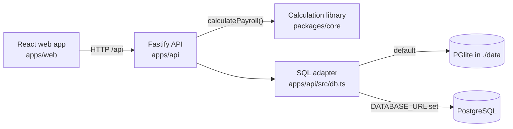

# PayFlow — India payroll workspace

PayFlow is a full-stack payroll application for Indian companies. It covers the whole monthly cycle: employee
records and hierarchy, CSV input import with validation, salary calculation (income tax, EPF, ESI and state
deductions), exception review, maker-checker approval, payslips, statutory preparation reports and an audit trail.
Employees get a self-service portal for their own record, tax-regime choice and payslip.

> **Synthetic data only.** PayFlow is a portfolio project. Its rules were reviewed against Indian regulations in
> October 2026, but it is not a certified payroll product and its exports are not government or bank upload
> formats. See [compliance notes](docs/compliance-notes.md).

## Roadmap

PayFlow is being rebuilt from its first prototype in phases. Each phase is committed and pushed when complete.

| Phase | Scope | Status |
|---|---|---|
| 0 · Baseline & cleanup | Rebrand to PayFlow, remove hosting/mobile code, run locally with zero setup | ✅ Done |
| Compliance review | Rules updated to October 2026 regulations: Labour Codes wage definition, EPF ₹25,000 ceiling with the September split, ESI period rules, state PT/LWF | ✅ Done |
| 1 · Engineering foundation | Shared Zod schemas, Drizzle migrations, modular Fastify API, React Router + TanStack Query, readable components, Vitest + API integration tests, CI | ⏳ Next |
| 2 · Multi-tenant sandbox | Sign up and create an organization, start empty or load a sample company, tenant isolation, invitations, any pay period, salary revisions, state rule tables | Planned |
| 3 · Features | Payslip PDFs and history, tax-regime calculator, analytics dashboard, leave & attendance, notifications, Ctrl-K palette, dark mode, audit log page | Planned |
| 4 · Docs polish | Refreshed screenshots, architecture walkthrough | Planned |

## Tech stack

| Part | Stack |
|---|---|
| `apps/web` | React 19, Vite, TypeScript, lucide-react icons, hand-written CSS |
| `apps/api` | Node.js 24, Fastify 5, TypeScript, PGlite (embedded PostgreSQL) or PostgreSQL |
| `packages/core` | Pure TypeScript payroll and tax calculation library (all money in integer paise) |



## Quick start

Requires **Node.js 24** and npm. Nothing else: the database is embedded.

```bash
npm install
npm run dev
```

Open <http://127.0.0.1:5173>. The API runs on port 4000. On first launch it creates a synthetic company
("Aster Group", 8,420 fictional people across five Indian states) in `data/payroll-pg`.

### Sign in

Six accounts are created on first launch, each with its own random password. The passwords are written to
`data/individual-demo-credentials.txt` on your machine (ignored by Git).

| Username | Role |
|---|---|
| `admin` | Organization admin: manage accounts, reset demo data |
| `hr` | HR operator: people, hierarchy, payroll preparation |
| `payroll` | Payroll operator: import and calculate |
| `finance` | Finance approver: approve and reconcile |
| `auditor` | Read-only review and reports |
| `employee` | Employee self-service for `EMP00001` |

To use an external PostgreSQL database instead of the embedded one, set `DATABASE_URL` before `npm run dev`.

## Try the payroll journey

1. Sign in as `hr` and open **Payroll Runs**. Import [sample inputs](samples/payroll-inputs.csv) or use the
   preloaded ones, then **Calculate**.
2. Twelve employees have missing bank details, which block submission. Verify them from the **Needs attention**
   panel and recalculate.
3. **Send for approval**, then sign in as `finance` and approve. The preparer can never approve their own run.
4. Export the demo bank file and preparation reports, then simulate reconciliation.
5. Sign in as `employee` to see only your own record, choose a tax regime (while the run is in draft) and view the
   payslip after approval.
6. Open **Hierarchy** to filter people by employment type, position level, department and state, and add a person.

## Features

- **Calculation engine** (rule version `IN-TY2026-27-v2`, reviewed October 2026):
  - Income-tax Act, 2025: both regimes, the ₹60,000 rebate with marginal relief, surcharge and cess, and monthly
    TDS (s. 392) from a year-to-date projection.
  - Labour Codes "wages" with the 50% exclusion cap.
  - EPF/EPS/EDLI: the ₹25,000 ceiling from 17 September 2026 with the EPFO day-split for September, EPS exit at
    58, and admin charges.
  - ESI: contribution-period continuation and the ₹176/day exemption.
  - Professional tax and labour welfare fund slabs for Karnataka, Maharashtra, Tamil Nadu, West Bengal and Haryana.
  - The employer cost of every line.
- **Payroll controls**: CSV validation with preview, inputs locked after calculation, blocking exceptions,
  separate finance approval, and an audit event for every key action.
- **People**: a searchable directory, an 8-level position hierarchy with five employment types, and contractors
  kept outside payroll.
- **Access**: password sessions (scrypt hashing, hashed tokens, 12-hour expiry), role-based permissions, login
  rate limiting, admin-issued one-time passwords and a forced first-password change.

## Interface (v1 screenshots)


## Scripts

| Command | What it does |
|---|---|
| `npm run dev` | Start the API and web app together |
| `npm run typecheck` | Type-check every workspace |
| `npm test` | Run the calculation library tests (30 statutory rule cases) |
| `npm run build` | Production build of all workspaces |
| `npm run smoke` | End-to-end API check against a running local API (full run, access control, approval gate) |
