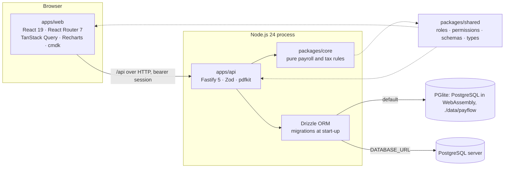
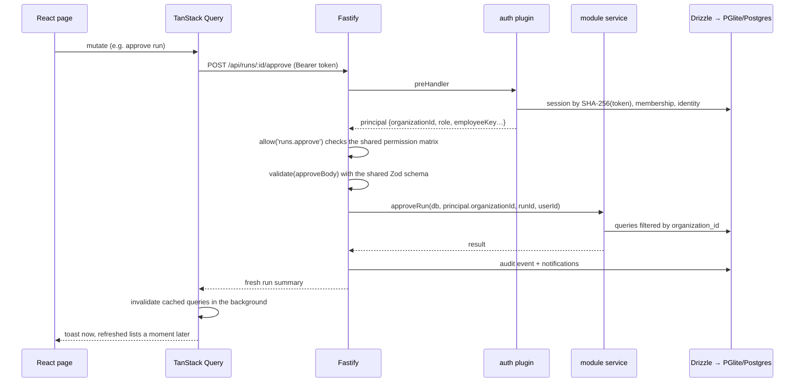
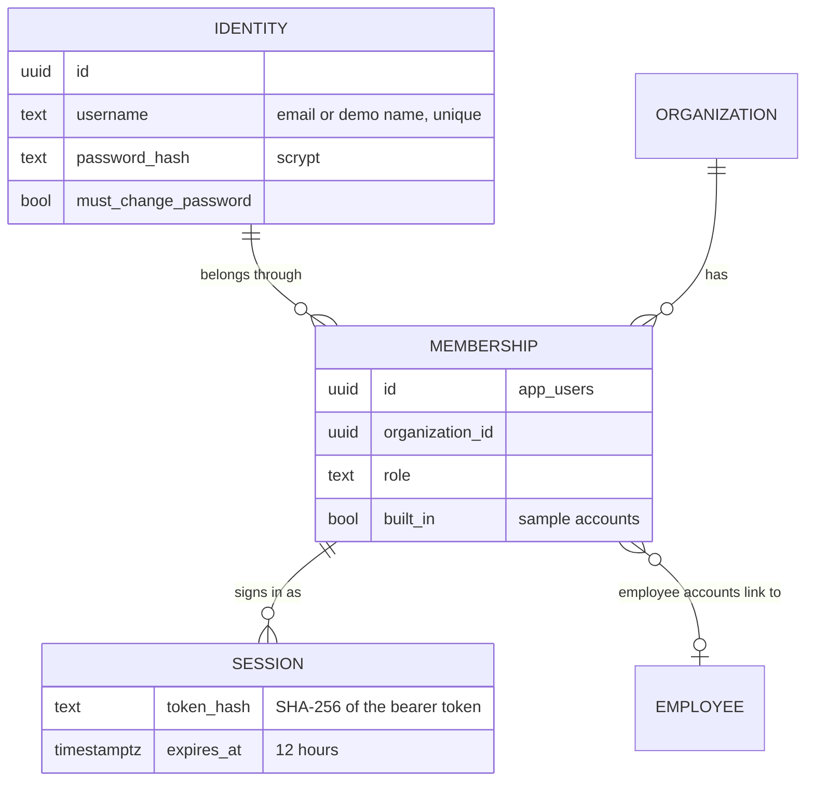
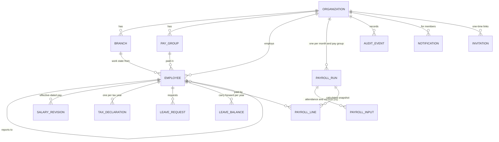
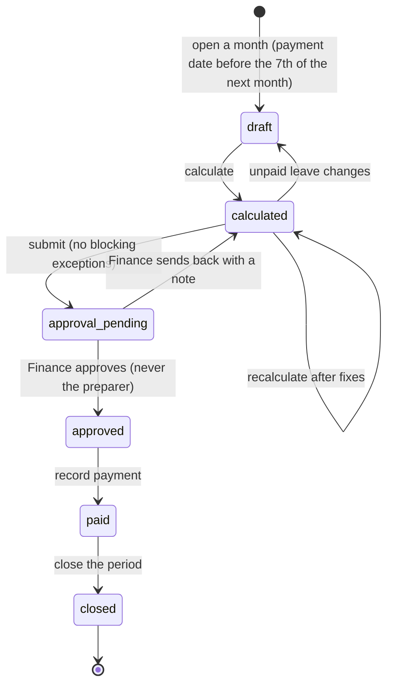
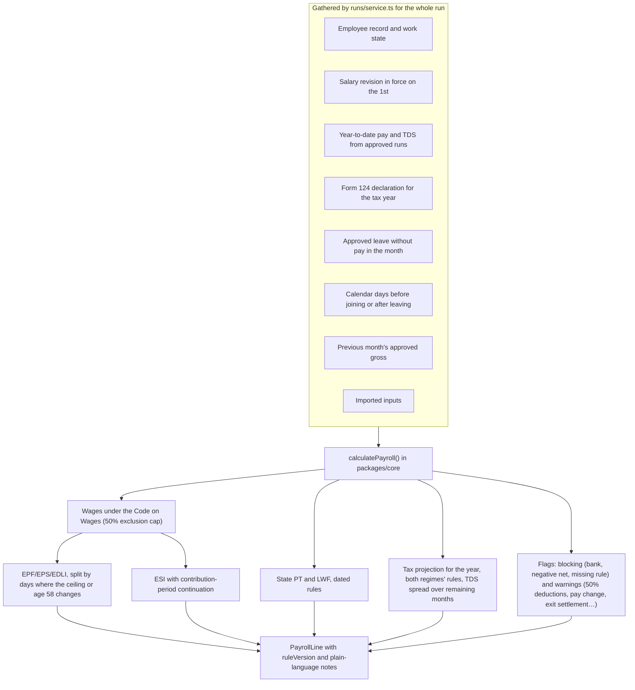

# Architecture walkthrough

This document explains how PayFlow is put together and why: the workspaces, what happens on a request, how
organizations are kept apart, how a pay run is calculated and frozen, and how the rules are versioned. The
[README](../README.md) covers running it; the [compliance notes](compliance-notes.md) cover the rules themselves.

## Goals that shaped the design

1. **Zero setup.** `npm install && npm run dev` must give a working app with realistic data, so the database is
   embedded and sample companies are generated on demand.
2. **Correct and explainable pay.** Every number on a payslip comes from a pure, tested function, and every line
   records the rule pack that produced it.
3. **Organizations never see each other.** Tenancy is enforced in every query, not just in the UI.
4. **One source of truth.** Roles, permissions, request schemas and response types are written once and shared by
   the API and the web app.

## Workspaces



| Workspace         | Depends on   | What lives there                                                                                                           |
| ----------------- | ------------ | -------------------------------------------------------------------------------------------------------------------------- |
| `packages/core`   | nothing      | Income tax, Labour Codes wages, EPF/EPS/EDLI, ESI, state PT/LWF, declarations, regime comparison, leave accrual. No I/O.   |
| `packages/shared` | core (types) | The role/permission matrix, Zod request schemas, response DTOs and constants such as run statuses and leave types.         |
| `apps/api`        | core, shared | `buildApp()` with one Fastify plugin per module; services that take an organization ID; Drizzle schema and SQL migrations. |
| `apps/web`        | shared       | Routes, a TanStack Query hook per endpoint, shared components, CSS split by area with light and dark design tokens.        |

The web app never imports `packages/core` directly except through the few helpers `shared` re-exports (leave-day
counting and declaration limits), so calculation stays on the server.

```text
apps/api/src
  app.ts                 buildApp(): plugins, error handler, module registration
  server.ts              opens the database, seeds the demo tenant once, listens
  db/                    schema.ts, client.ts (PGlite or pg), lock.ts (one process per data folder)
  plugins/auth.ts        session → principal, permission guards
  lib/                   errors + validate(), audit(), CSV writer
  modules/<area>/        routes.ts (HTTP) + service.ts (logic), for:
                         auth · organizations · employees · runs · leave · tax · analytics · workspace · notifications
apps/web/src
  app/                   router, providers (auth, feedback, theme), queries.ts, navigation, layout shell
  components/            Heading, StatCard, Pill, Drawer, Modal, Pagination, Stepper, EmptyState…
  features/<area>/       pages and drawers per domain
  styles/                tokens.css (both themes) then one file per area
```

## A request, end to end



Points worth noticing:

- **Validation and permissions are shared code.** The same `approveBody` schema and `PERMISSIONS` matrix are used by
  the API to enforce and by the web app to shape forms and hide actions. The UI hiding a button is never the guard.
- **Errors have one shape.** `HttpError` and Zod issues become `{ error, issues }`; the web client turns them into an
  error banner or inline messages.
- **Mutations refresh everything in the background.** Payroll totals, people and exceptions are interdependent, so a
  mutation invalidates all queries without waiting, and the confirmation appears as soon as the server accepts.

## Tenancy and identity



- A person has one **identity** (sign-in name and password) and a **membership** per organization, each with its own
  role. A session belongs to exactly one membership, so every request resolves to one organization.
- **Every business table has `organization_id`**, and every service function takes it as an argument and filters by
  it. Records from another organization are reported as _not found_ (404), never _forbidden_, so their existence is
  not revealed. Integration tests try to read and change another organization's runs, people, accounts and exports.
- **Switching organization** issues a new session for the same identity's other membership and ends the old one.
- An admin can reset a password only for people who belong to that organization alone; otherwise one organization
  could take over someone's access to another.
- **Sample companies** create built-in role accounts that have no usable password. The owner reaches them through an
  audited **View as** switch, which is how one person can try maker-checker alone.

## Data model



- **Money is integer paise** in `bigint` columns and in every calculation, so there is no floating-point drift;
  rounding to the rupee happens where the law rounds (EPF, PT) and ESI rounds up.
- **Dates are `YYYY-MM-DD` strings** compared lexically, and all date arithmetic is in UTC.
- **A payroll line is a snapshot.** The full calculation result is stored as JSON next to indexed totals (gross,
  deductions, net, tax, employer cost, flag counts). Totals and exports read the snapshot, so an approved month never
  changes when salaries, rules or people change later.
- The schema lives in [`apps/api/src/db/schema.ts`](../apps/api/src/db/schema.ts); migrations in
  `apps/api/drizzle` are generated by drizzle-kit and applied at start-up. When a change needs data moved (as when
  accounts became identities and memberships), the generated SQL is edited to backfill before columns are dropped,
  so existing local databases upgrade in place.

## The pay run



- **Inputs** are synchronised whenever a run is opened or recalculated: everyone employed for part of the month in
  the run's pay group gets a row. Imports (CSV, previewed and validated first) fill variable pay, deductions and
  attendance. Inputs freeze once the run goes to Finance.
- **Maker-checker** is enforced in the service, not the UI: the account that submitted can never approve.
- **Approved means frozen.** Lines cannot be recalculated, salary revisions can only start after the last approved
  month, and leave without pay cannot be approved for a month that is with Finance.

### What goes into one line



The same `projectTax()` that sets monthly TDS powers the employee's regime calculator, so the comparison an
employee sees is exactly what payroll would deduct.

## Rule packs and versioning

- `RULE_VERSION` (`IN-TY2026-27-v3+IN-STATES-2026-10b`) is stored on every line and shown in the calculation trace.
  Changing a rule means changing the version, so old lines still say which rules produced them.
- Rules that change on a date take the pay period's date: the EPF ceiling (17 September 2026), Haryana's indexed LWF
  cap (each 1 January) and West Bengal's professional tax schedule (1 October 2026) all keep their earlier values
  for earlier months.
- States without a reviewed rule produce a **blocking** flag, and branches can only be created in states that have
  one, so an unsupported state can never be paid silently.
- Periods outside the reviewed tax year carry a `RULES_NOT_REVIEWED` warning.

To change a rule: edit `packages/core`, add a test with the new and old values, bump the version, update
[`compliance-notes.md`](compliance-notes.md) with the source, and run the full suite.

## Web app

- **Routing** is real URLs (`createBrowserRouter`). Staff and employees get different navigation from one
  permission-aware list; route guards mirror the API's permissions.
- **Data** goes through one hook per endpoint in [`app/queries.ts`](../apps/web/src/app/queries.ts). Notifications
  poll every 30 seconds; nothing else polls.
- **Theming**: every colour is a token in [`styles/tokens.css`](../apps/web/src/styles/tokens.css). Dark mode
  redefines the same names under `[data-theme='dark']`, which a small script in `index.html` sets before the first
  paint. Charts read their colours from the same tokens.
- **Code splitting**: the chart library is loaded only by the analytics page and the overview's trend panel, and
  framework code is cached in its own chunk.
- **Command palette** (Ctrl K / ⌘ K, cmdk) searches people and pay runs on the server and pages and actions locally.

## Security measures in the demo

| Area       | Measure                                                                                                           |
| ---------- | ----------------------------------------------------------------------------------------------------------------- |
| Passwords  | scrypt with per-password salt; minimum 12 characters; invitees choose their own; admin resets force a change      |
| Sessions   | 32-byte random bearer tokens; only a SHA-256 hash is stored; 12-hour expiry; logout and password changes end them |
| Abuse      | Rate limits on sign-in, sign-up and invitation links; lockout after five failures for 15 minutes                  |
| Access     | Permission matrix checked on every route; employees only reach their own record, payslips, tax and leave          |
| Tenancy    | Organization ID on every row and query; cross-organization access returns 404                                     |
| Exports    | CSV cells that could run as formulas are neutralised; the bank file is marked demo-only                           |
| Audit      | Sign-ins, changes, approvals, exports, payslip downloads and role switches are recorded with actor and time       |
| Deployment | The API refuses to start with `NODE_ENV=production`, because this is a demonstration with synthetic data          |

## Testing strategy

| Layer    | Tool                         | What it proves                                                                                                                                                                |
| -------- | ---------------------------- | ----------------------------------------------------------------------------------------------------------------------------------------------------------------------------- |
| Rules    | Vitest, `packages/core`      | Statutory edge cases: rebate and marginal relief, surcharge bands, EPF ceiling splits, ESI thresholds, state slabs, deduction limits, leave accrual, net = gross − deductions |
| API      | Vitest + `app.inject`        | The real app on in-memory PGlite: permissions, tenant isolation, run lifecycle, imports, leave and tax flows, notifications, PDF output                                       |
| Journeys | Playwright                   | Real browser across roles: prepare → send back → approve → pay → close; sign-up with a sample; leave to pay run; audit filters                                                |
| Static   | TypeScript, ESLint, Prettier | Types across all workspaces, React hooks rules, consistent formatting                                                                                                         |

GitHub Actions runs format, lint, typecheck, unit and API tests and the build on every push, then the Playwright
journeys against Chromium.

## Configuration

| Variable                   | Default                 | Purpose                                                                  |
| -------------------------- | ----------------------- | ------------------------------------------------------------------------ |
| `DATABASE_URL`             | unset (embedded PGlite) | Use a PostgreSQL server instead of the embedded database                 |
| `PAYFLOW_DATA_DIRECTORY`   | `data/payflow`          | Where PGlite keeps its files; `memory` for a throwaway database          |
| `PAYFLOW_SEED_SIZE`        | `8420`                  | People in the built-in Aster Group tenant (created once, on first start) |
| `PAYFLOW_DEMO_PASSWORD`    | random per account      | One password for all Aster Group accounts (used by the end-to-end tests) |
| `PAYFLOW_LOGIN_RATE_LIMIT` | `20` a minute           | Sign-in attempts allowed per client                                      |
| `PORT`, `HOST`             | `4000`, `127.0.0.1`     | Where the API listens                                                    |
| `PAYFLOW_API_URL`          | `http://127.0.0.1:4000` | Where the web dev server proxies `/api`                                  |

## Trade-offs

- **PGlite by default** gives a real PostgreSQL with no installation; the cost is a single API process per data
  folder (enforced by a lock file). Production-like setups point `DATABASE_URL` at PostgreSQL.
- **Central rule pack, not per-organization rules.** Organizations cannot edit statutory rates, so none can drift
  from the reviewed values; supporting a new state is a code change with tests.
- **Snapshots over recomputation.** Storing each line's full result makes approved months immutable and audits
  simple, at the cost of some storage.
- **Polling over websockets** for notifications keeps the server stateless; a 30-second delay is acceptable for
  approvals and leave decisions.
- **No email.** Invitations are one-time links the admin shares, which keeps the sandbox self-contained.
